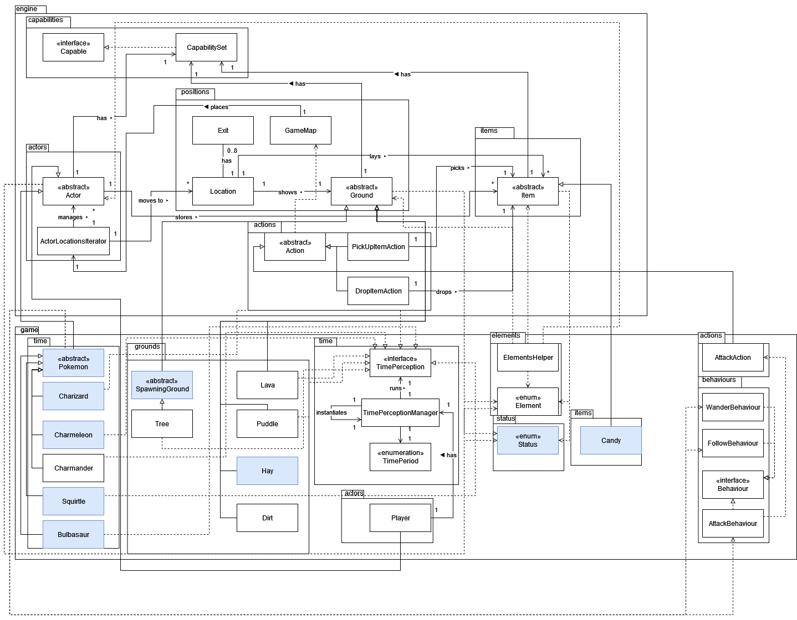

# FIT2099 Assignment (Semester 2 - 2022) - Pokemon!

## MA_Lab04Team03
Team members:
* Kerk Han Chin 33036128 kchi0068@student.monash.edu
* Louis Meng Hoe Chow 32937350 lcho0031@student.monash.edu

Link to contribution logs spreadsheet: https://docs.google.com/spreadsheets/d/1OrNRrshy5kDjwnewv2srlX6KrO_rSOlWCou41vnIt2Q/edit?usp=sharing

## CREATIVE MODE
# Requirement 4

**Title**:
_Expanded Time Functionality_

**Description**:
_Currently, the time periods in the game are limited to just day and night. This could be expanded via the addition of
extra 'special event' time periods into the game. Where before, there would just be a day and a night time period, now there is a chance that a unique time event may occur—such as a solar flare or a new moon. For these 'special event' time periods, the various in-game entities that perceive time will experience more 'stronger' versions of existing effects. During a solar flare or a new moon, certain Pokemon will become stronger or weaker, will heal or be hurt by a greater amount, or even be immobilized._

_In detail, during a solar flare:_
_Charmander, Charizard, and Charmeleon will be healed by 15 hp each turn, and will be stronger._
_Bulbasaur will be hurt by 10 hp each turn, will be weaker, and cannot move._
_Squirtle will be hurt by 15 hp each turn, will be weaker, and cannot move._

_During a new moon:_
_Charmander, Charizard, and Charmeleon will be hurt by 15 hp each turn, will be weaker, and cannot move._
_Bulbasaur will be healed by 10 hp each turn, and will be stronger._
_Squirtle will be healed by 15 hp each turn, and will be stronger._

**Explanation why it adheres to SOLID principles** (WHY):

-Our new functionality adheres to the Open-Closed principle, as the expansion of our time functionality is implemented
without modifying our existing classes and code related to time perception. New solarFlareEffect() and newMoonEffect() methods will be added to the classes implementing
TimePerception, which does not modify the existing dayEffect() and nightEffect() methods. Furthermore, the way in which we implement this new functionality by building off of our existing code for time functionality means that we also adhere to the Dependency Inversion Principle because the higher level modules do not depend on the lower level modules—our concrete classes depend upon abstractions, specifically the TimePerception interface. The higher level module in this case is our TimePerceptionManager which merely depends upon the TimePerception interface. The Single Responsibility Principle is also adhered to because once again, each class has only one responsibility. Each Pokemon class has the responsibility of executing the time effects, while the TimePerceptionManager only has the responsibility of signaling to each Pokemon class which timePeriodEffect method to call based off the time period it switches to.

| Requirements                                                                                                            | Features (HOW) / Your Approach / Answer                                                                                                                               |
| ----------------------------------------------------------------------------------------------------------------------- | --------------------------------------------------------------------------------------------------------------------------------------------------------------------- |
| Must use at least two (2) classes from the engine package                                                               | _In implementing the additional functionality for the new time periods, we will use the following two classes from the engine package: Actor and Ground. We will add timePeriodEffect methods to the various Pokemon and Ground classes in the Pokemon game such as Charmander, Bulbasaur, Squirtle, Tree, Lava, and Puddle. The Pokemon classes extends Actor, while Lava and Puddle extends Ground and Tree is a SpawningGround which extends Ground._ |
| Must use/re-use at least one(1) existing feature (either from assignment 2 and/or fixed requirements from assignment 3) | _Reuses the existing functionality related to time that implements a day/night functionality._
| Must use existing or create new abstractions (e.g., abstract or interface, apart from the engine code)                                                                                                                                                                       | _Makes use of the existing abstraction of the TimePerception interface by adding new timePeriodEffect() methods in the interface, requiring classes that implement TimePerception to specify functionality for the new time periods._                  |                                                                                                                                                                       | 
| Must use existing or create new capabilities                                                                            | _Creates new capabilities such as the status that makes Pokemon stronger (BUFFED) during a solar flare or a new moon event, as well as the status that determines if a Pokemon can move a solar flare or a new moon event (CAN_MOVE)_                                                                                                                                                                      | 
---

## Changes to Design Rationale
The main change to our design rationale is that the previous Pokefruit concrete class has now been converted to an abstract class which is extended by three Pokefruit classes (FirePokefruit, WaterPokefruit, GrassPokefruit). This has the benefit of reducing a switch-case code smell as previously, different functionality would've occurred depending on a Pokefruit's element. Also, for REQ 5, previously the TimePerceptionManager was to be instantiated in the GameMap, however now, the TimePerceptionManager will be instantiated within the Player class since once the Player dies, the game ends, and each time the Player's processActorTurn method is called, it provides us an opportunity to run the time perception functionality. This has the benefit of not altering the Engine code in any way, shape or form.

## Design Rationale

_Please write your design rationale below (along with UML diagram pictures)..._

A3-REQ1: Evolution

The implementation of Evolution & alongside it some new pokemons and their different SpecialAttacks involves the creation of a new Behaviour & Action class: EvolutionBehaviour and EvolveAction respectively. Subclasses of Pokemon are also created for Charizard and Charmeleon, the evolutionary line of Charmander, with their new weapons; namely Blaze & FireSpin being added into the weapons package as a subclass of WeaponItem. BackupWeapon class has also been utilised to house all these WeaponItem classes, and in tangent to it some adjustments will be made to SpecialAttackBehavior to house the new functionality.

Beginning with the implementation of the Evolution itself, a new Capability has been added into Status called CAN_EVOLVE which can be added into pokemons that are expected to evolve into another pokemon. Using this capability, EvolutionBehaviour will be able to check whether the pokemon will be allowed to evolve or not alongside a side condition of having the pokemon’s surroundings being empty, and if they are able to, it would return an EvolveAction instance, which details the evolution of the pokemon via retrieving their evolved version that will be implemented into each subclass of Pokemon and replacing them in the map itself. EvolveAction will also allow the player to manually evolve the pokemon, as it would be implemented into the allowableActions of the Pokemon class and checked for conditions like the need to have reached 100 Affection Points with the Trainer. The introduction of Charizard also means that an extra Element will be introduced into the Element Enum, namely the Dragon Element, which at the moment has no relevant use but can be implemented easily for future work.

The implementation of the WeaponItem Blaze & FireSpin also required some extra adjustments to the existing class alongside some additional classes. For Blaze particularly it functions similarly to Ember, but since it will be stored alongside Ember in Charmeleon & Charizard’s Weapon Inventory BackupWeapon has been used to store those weapons and has a method to retrieve one of those weapons randomly should it be called out. FireSpin as an additional trait that drops Fire in the 8 tiles around the pokemon that has the weapon equipped every turn, so it was created as an Item with a tick method implemented into it to track how many turns before it has to be removed and to also dealt damage to Pokemons without the Element FIRE in their capability.

In tangent to our design rationale, we chose to bind evolution potential to the Pokemon subclasses via enumeration as it adheres to the open-closed principle with the ability to add new Pokemons or even update existing Pokemon to be able to evolve. It also adheres to the DRY (Don’t Repeat Yourself) Principle, as all evolution code has been implemented into the Pokemon Abstract Class, without the need to constantly recode it into the numerous subclasses of Pokemon that require evolution.

A3-REQ2: Pokemon Center (New Map)

The implementation of the Pokemon Center involves the creation of a Door class which is an item and hence extends from the Item abstract class, as well as the creation of the TeleportActorAction class—which extends from the MoveActorAction class—that was created in order to accommodate the change in the menu description from ‘actor moves to direction’ to ‘actor enters direction’. The Door has a TeleportActorAction that allows the player to be moved/teleported to the destination that the Door was assigned to. A new NurseJoy class that extends actor was created to fit the requirement that a NurseJoy be in the pokemon center. Within the Application class, an additional game map for the pokemon centre was added and two doors were instantiated—one door that teleports the player to the Pokemon Center and another door that teleports the player back to Pallet Town. 

As the interaction diagram above shows, the teleporting functionality is implemented via the Door item possessing a TeleportActorAction to a particular destination. When the player ash is atop a Door item, ash is allowed to select the action to teleport to that destination from the menu, and if chosen, that TeleportActorAction is executed and ash is moved to that destination.

Regarding our design rationale, we chose to have one Door class rather than have multiple Door classes (i.e. having one ‘Door’ class rather than a ‘DoorToPokemonCentre’ and ‘DoorToPalletTown’ class) in order to adhere to the Don’t Repeat Yourself (DRY) Principle. Furthermore, our design adheres to the open-closed principle because our current system allows for future game maps to be added without requiring extensive modification to the existing code. The new game maps simply need to be passed into the ‘Door’ class. Also, our implementation heavily builds off of existing systems which further cuts down on code reuse. For example, the new pokemon center game map was added to the world’s list of game maps, and the MoveActorAction was reused rather than creating our own teleportation functionality. In addition, by splitting the teleport functionality of the door into its own TeleportActorAction class, we adhere to the Single Responsibility Principle in that each class is responsible for only one responsibility. 

A3-REQ4: Expanded Time Functionality (CREATIVE MODE)

The implementation of our expanded time functionality involves the addition of two new time periods—SOLAR_FLARE and NEW_MOON. These two new time periods are special events that have a 5% chance of occurring every time a time shift occurs (i.e. time changes from day to night and vice versa). SOLAR_FLARE can occur when the previous time period was NIGHT or NEW_MOON, and likewise NEW_MOON can occur when the previous time period was DAY or SOLAR_FLARE. During these special event time periods, the existing time period effects on Pokemon are enhanced. For example, Charmander heals by 10hp during DAY and is hurt by 10hp during NIGHT. During a SOLAR_FLARE, Charmander heals by 15hp and is buffed to be stronger, while during a NEW_MOON, Charmander is hurt by 15hp and is immobilized (cannot move). Meanwhile for the grounds that perceive time, their functionality during a SOLAR_FLARE is the same as that during the DAY, and likewise their functionality during a NEW_MOON is the same as during the NIGHT. The functionalities for the new special event time periods are implemented in the newly created solarFlareEffect() and newMoonEffect() methods. 

Within the AttackAction, when a Pokemon is buffed, then its base damage is multiplied by 1.2. Else, its base damage is multiplied by 0.8. Meanwhile the WanderBehaviour and FollowBehaviours will return null if a Pokemon does not have the CAN_MOVE capability.

Regarding our design rationale, we chose to implement the new special event time periods by adding them to the existing TimePeriod enumeration rather than the alternative which was to create a separate SpecialEvent enumeration in order to make use of the fact that our existing code adheres to the Open-closed principle that allows for easy future extensions without necessitating modifications to existing code. By building off of the existing Time Period Functionality, our expanded functionality was able to be implemented without needing us to modify existing code. Furthermore, it also meant that we adhered to the Don’t Repeat Yourself (DRY) Principle as implementing our special event time periods via a separate SpecialEvent enumeration would’ve most likely resulted in repeated code also seen in the existing Time Period functionality.

All that said, we did identify a code smell in that if we were to expand our time period functionality even further, we would end up with an even longer and more complicated if condition when determining which time period to switch to. Ultimately, we chose not to, since the only possible expansion to the time period functionality would be in the form of additional special event time periods—and as we mentioned earlier, creating a separate SpecialEvent enum would violate the Don’t Repeat Yourself principle. 

REQ1: Environment Design Rationale

The above UML Diagram displays the object-oriented system that models the environment of the Pokemon game, with 6 concrete classes representing the 6 unique ground types so far—Crater, Waterfall, Tree, Lava, Puddle, and Hay. Of the 6, 3 are brand new—those being Crater, Waterfall, and Hay.

Other new classes introduced include the Squirtle and Bulbasaur classes representing Pokemon that a spawning ground can spawn, and pokefruit that a spawning ground can drop. Finally, two new abstract classes have been added. Pokemon serves to abstract the commonalities between the 3 Pokemon classes (Charmander, Squirtle, Bulbasaur) while SpawningGround serves to abstract the commonalities between the 3 spawning grounds (Crater, Waterfall, Tree).

The new functionality we added to the game allows for certain grounds to spawn Pokemon and Pokefruit whose elements match the element of the ground, and this functionality was primarily implemented via the methods in the abstract SpawningGround class—tentatively named spawnPokemon and spawnPokefruit. For example, Crater’s implementation of spawnPokemon would first see if a 10% probability check is passed, and if so, then call the addActor method on its location which is a method in the GameMap class, passing in a Charmander as the actor to be spawned. Meanwhile, the implementation of spawnPokemon for Waterfall and Tree would involve calling the getExits method on their locations and then looping through the list of exits to ensure there are either at least two water element grounds surrounding the location in the case of Waterfall or at least one grass element ground surrounding the location in the case of Tree, then after passing a probability roll, a Squirtle (for Waterfall) or Bulbasaur is spawned (for Tree) via the same mechanism by which Crater spawned a Charmander.

The implementation of Pokefruit dropping in spawnPokefruit starts with a probability check, and once passed, the addItem method that belongs to the location where the ground is will be called, passing in a Pokefruit item whose element matches the element of the ground. For example, Crater spawns a FirePokefruit and Tree spawns a GrassPokefruit.

Regarding our design rationale, we realized that the spawning grounds (Crater, Waterfall, and Tree) shared many commonalities in terms of their methods which only had minute differences in code, hence it was only logical that we created the abstract SpawningGround class to abstract away these identities to avoid repetitions in our code as per the Don’t Repeat Yourself principle. Furthermore, by having the abstract SpawningGround class interact with the abstract Pokemon class when spawning Pokemon, it means that it will be easier in the future to implement new spawning grounds that can spawn Pokemon into the system, and likewise the same can be said for new Pokemon—who can be spawned by existing spawning grounds quite efficiently. This makes our code far easier to extend which is important as the requirements mentioned that the Pokemon-spawning functionality will only get more complex in the future. Our current implementation would definitely be preferable to the alternative of having each spawning ground be dependent on each individual pokemon, because that implementation would result in a larger number of dependencies than the current implementation. Hence, our current implementation follows the Reduce Dependency principle.

That said, since the spawning grounds only shared similar method implementations, an interface could’ve been just as viable. In fact, an argument could be made that if we implemented the spawning capabilities of spawning grounds in the form of interfaces, we’ll be able to further improve the extensibility of our system. This is because we’ll be able to split the pokemon-spawning and pokefruit-spawning functionalities (currently combined into the SpawningGround abstract class) into two separate interfaces as per the Interface Segregation Principle, which allows for the implementation of future spawning grounds that spawn only Pokemon or spawn only Pokefruit or even spawn something else entirely. 

However, since the requirements defined a spawning ground as a ground capable of spawning Pokemon and Pokefruit, we ultimately chose to bundle the functionalities together into one abstract SpawningGround class as this is functionality that every spawning ground should have.  

REQ2: Pokemon Design Rationale

The above UML Diagram models the object-oriented system that implements a few additional classes throughout the game engine, namely the Pokemon subclasses, the WeaponItem subclasses, the AttackBehavior subclasses & finally certain enums like IntrisicHit to help differentiate certain minor details between classes.

The Pokemon subclasses, consisting of Charmander, Squirtle & Bulbasaur inherits its superclass’ traits Pokemon, so it has all of its functionality including whatever that is implemented within the pokemons themselves. The enumeration Element is very useful in this situation to help distinguish the Pokemon’s traits since their main separating factor functionality wise at the current moment is their Elements, so likewise according to the instructions they will be assigned as such. Charmander will have Element.FIRE added into their capabilities, Bulbasaur will have Element.GRASS added into their capabilities, & finally Squirtle will have Element.WATER added into their capabilities. This in similarity is also how Special Attacks are implemented into the design, with Ember, Bubble & VineWhip all being subclasses of WeaponItem, should have one of the Element Types assigned into their specific constructors (Ember having fire, Bubble having water, VineWhip having grass, etc.), although it won’t be used in this design, it will be useful to have it in future uses for additional functionality changes.

As specified & described per Requirement 1, all the Pokemons are spawned individually in their own specific SpawningGround based on their own conditions, and should be reflected in the actual design of the code. In the current Requirement, one of the most important additions to the design is the implementation of Attacking as a behaviour for wandering Pokemons, and as per design it is separated into two types of Attacks: Intrinsic & Special Attack. As SpecialAttackBehavior will always check if their conditions are met before performing the next moves, it should always come first in the priority list of behaviours to be conducted by the Pokemon. Functionality-wise, it takes the specific Pokemon’s element by using the method findCapabilitiesByType(Element.class), which will return a list of enums. Using that list of enums, you could use it as a switch statement to separate the conditions of FIRE, GRASS & WATER. Which then, utilising the methods from ElementHelper, you could check if the conditions for the Special Attacks are satisfied. Take Charmander for example, whose requirement is that it has to be on a ground with the fire element, you could fetch the object of the ground the Pokemon is currently standing on & compare it with a temporary enum list consisting of Element.FIRE. If it passes the condition, you equip the Charmander with WeaponItem Ember, initialise the method to attack, then unequip. The other elements follow similar patterns as stated above, with the only difference being that Squirtle can meet the condition if a Pokemon with Element Type Fire is within the Squirtle’s 8 Exits. In that case you add an additional condition to retrieve whether there is the presence of a pokemon in the exits, retrieve its type, then compare and see if it passes.

Intrinsic Attacks are more simple in comparison, as there aren't any checks to be met based on the Pokemon’s surroundings. That being said, as stated in the requirements the Intrinsic Weapons are varied based on the Pokemon, so since there are only 3 Pokemons currently implemented, you could check based on the Pokemon’s Element, pass it into a switch case and set the verb & damage individually inside said switch case.

At the whole of the implementation, no parts of the engine code was tempered in any way, so the design is faithful to that instruction, should there be expansion to any functionality to the code it would be fairly easy to integrate it with our design, as the behaviours implemented are centralised into the Pokemon class. Usage of enums are easily transferable into future Pokemon and Special Attack entries, regardless of whether they have elements or not, which adheres to the Open-close principle.

REQ3: Items Design Rationale

The above UML Diagram models the object-oriented system that implements the 3 newly-added items to the game—pokeball, pokefruit, and candy. Pokeball has the capability to catch pokemon (i.e. it has the status Status.CAN_CATCH_POKEMON) and subsequently stores said pokemon to summon later on (i.e. it has the status Status.CAN_SUMMON_POKEMON), whereas Pokefruit is an abstract class extended by 3 concrete classes that correspond to each possible element for a Pokefruit (namely FirePokefruit, WaterPokefruit, and GrassPokefruit). Each Pokefruit has an element (i.e. A Pokefruit can be of element Element.FIRE, Element.WATER, or Element.GRASS) and can be fed to a Pokemon to either increase or decrease their affection rate depending on the Pokemon’s element (i.e. it has the status Status.CAN_FEED_POKEMON_FIRE_POKEFRUIT, Status.CAN_FEED_POKEMON_WATER_POKEFRUIT, or Status.CAN_FEED_POKEMON_GRASS_POKEFRUIT).  Finally, since we need not accomplish REQ 6, candy is simply an item that is dropped whenever a pokemon is successfully captured.

In order to model the capturing of a pokemon, a CatchPokemonAction was created that inherits from the abstract Action class. This action allows the Player to capture a pokemon if they possess a pokeball. Since a pokeball has the CAN_CATCH_POKEMON capability, the Player will also possess this capability if they possess a pokeball. Without this capability, the Player cannot take this action. This status is checked via the newly-created StatusHelper class which has a method hasAnySimilarStatuses which is called to check this condition. The CatchPokemonAction has a targetPokemon as an attribute and when executed and the result is a success, the targetPokemon is removed from the map with the removeActor method in the GameMap class and the targetPokemon is then stored as an attribute in the Pokeball instance.

If the CatchPokemonAction is successful, then a Candy object is instantiated and placed on the location in the game map. The Player can choose to pick up or drop the Candy through the PickUpItemAction and DropItemAction actions that are associated with every action since these two actions are actions of the Item abstract class.

To model the summoning of a pokemon, as the above UML Interaction Diagram shows, a SummonPokemonAction was created that inherits from the abstract Action class. Since a pokeball has the CAN_SUMMON_POKEMON capability, the Player will also possess this capability if they possess a pokeball. Without this capability, the Player cannot take this action. This status is checked via the newly-created StatusHelper class which has a method hasAnySimilarStatuses which is called to check this condition. SummonPokemonAction has a targetPokeball as an attribute. When executed with a targetPokeball that’s empty (i.e. it doesn’t store a Pokemon), then nothing happens. But if executed with a targetPokeball that stores a Pokemon then the Pokemon stored within the Pokeball is summoned onto an adjacent square next to the Player. This summoning process involves obtaining the location the Player is currently on via the locationOf method in the GameMap class, then calling the getExits method on the location and then looping through the list of exits until the first exit where a Pokemon can be spawned on is found, then at last the Pokemon is summoned via the addActor method in the Game Map class on said exit’s location.

The FeedPokemonAction models the feeding of a pokefruit to a pokemon. Since a pokefruit has a status that indicates that it can be fed to a pokemon of the same element (e.g. Status.CAN_FEED_POKEMON_FIRE_POKEFRUIT if the pokefruit is of element Element.FIRE), the Player will also possess that specific capability if they possess a pokefruit. Without this capability, the Player cannot take this action. This status is checked via the newly-created StatusHelper class which has a method hasAnySimilarStatuses which is called to check this condition. The FeedPokemonAction has a targetPokemon to feed as an attribute, and when executed, a comparison is performed between the element of the pokefruit and the element of the pokemon. If the elements match, then the targetPokemon’s affection points will increase when this action is executed. This condition is checked via the hasAnySimilarElements method in the ElementsHelper class. However, if the elements do not match, then the targetPokemon’s affection points will decrease when this action is executed. For example, a fire Pokefruit will have the capability Element.FIRE. If fed to a Charmander, that Charmander’s affection points increases, but if fed to a Bulbasaur, that Bulbasaur’s affection points decreases. 

We opted to implement the functionality by having the 3 new items inherit from the abstract Item class which is logical since they are items, and in doing so, this allows us to reuse code such as the code for PickUpItemAction and DropItemAction since the Candy item must have the functionality to be picked up or dropped and in doing so, we adhere to the Don’t Repeat Yourself Principle. The 3 new actions also inherit from the abstract Action class which not only greatly cuts down on repeated code, but also cuts down on dependencies as CatchPokemonAction and SummonPokemonAction depend on GameMap, but by having them extend the abstract Action class, there is only the dependency between the Action class on the GameMap class which adheres to the Reduce Dependency Principle. The Single Responsibility Principle is also adhered to as the actions associated with owning a pokeball (i.e. the actions of capturing and summoning a pokemon) aren’t combined into one GOD class and are instead split into two different classes (CatchPokemonAction and SummonPokemonAction) that accomplish only one task. 

Furthermore, the creation of the StatusesHelper class to help check for the status of actors, grounds, and items helped to reduce repetitions in code as well since otherwise, we would’ve had a lot of code smells whenever we had to check if the Player possessed a certain status or not. In other words, the code for checking if a Player could summon a Pokemon is similar to the code for checking if a Player could catch a Pokemon, hence why it made logical sense to cut down on repeated code through the creation of the StatusesHelper class. Also, it helps to follow the design of the already-existing code as well which has an ElementHelper in place to handle comparison of elements in actors, items, and grounds.

However, the Dependency Inversion Principle is violated because the Action abstract class depends greatly on the GameMap class in order to implement functionality for actions that involve the spawning of actors and items. This, unfortunately, can’t be changed since it’s part of the engine’s design. 

Though we can’t touch the engine’s code, we can touch our own code. We identified that our code for feeding a pokefruit to a Pokemon has a distinct code smell, because it can definitely be reused for feeding other items to a Pokemon, not just pokefruit. Admittedly, we could have implemented a PokemonConsumableItem interface to abstract away items that can be consumed by Pokemon such as Pokefruit which would adhere to the Open-closed Principle as we would be taking extensibility without modifying existing code into account. Ultimately, we chose not to since the consumption of a Pokefruit has a unique effect (i.e. affecting the affection rate of a Pokemon) compared to other possible items that Pokemon could consume (e.g. a health item) so it would not have been wise to abstract that aspect away. 

REQ4: Interactions Design Rationale

The above UML Diagram visualises the required specifications instructed in REQ4, with some implementation of the Affection system into the Action Methods for Catching, Feeding & Summoning a Pokemon to be used by the Player. As implemented previously in REQ3, Pokeball, Candy & Pokefruit are items that could be used as pickup items for the player, as denoted by the Status element added into them respectively.

In this Requirement, since all the necessary Action Methods have been implemented into the design as part of the making of the Items in the game, the only thing that has to be added into the design is Affection. This is firstly implemented into the code by utilising an interface called AffectionCheck which will have Classes CatchPokemonAction & FeedPokemonFruitAction implemented, as these two Actions are the ones that require a check in a Pokemon’s affection. In addition, the Pokemon abstract class should be altered in a way that an additional local variable should be added, namely an Integer used to gauge the current Pokemon’s Affection. This integer will be defaulted to a value between 0 to 100 upon creation of the Pokemon inside the constructor, as specified in the scenario (This could be done by importing & utilising the Randint method). 

The AffectionCheck interface will contain base methods to increase, decrease, & compare Affection using the Pokemon object as the argument. This allows classes like CatchPokemonAction & FeedPokemonFruitAction to implement the affection system into their requirements, for example CatchPokemonAction would use the compare function (ex: checkAffectionRequirements(actor pokemon)) and retrieve the specified Pokemon’s Affection and check if it greater than the condition (in this case, 50) that it requires, and based on that branch into different results unique to that class. FeedPokemonFruitAction would be similar as well, with its only difference being that you have to fetch the Pokemon’s Element type instead and compare it with the Pokefruit’s element, and with that adjust the results to increase Affection by 20 if pass, or decrease Affection by 10 if fail. Both classes can implement an extra method to remove the Pokemon’s capability Status.CAN_CATCH_POKEMON if the resulting Affection passes the limit (which in this case is -50).

As part of this requirement, the pokemon class can also contain the behaviour to follow the player around should it not have other Behaviours of high priority than itself (as per REQ2, SpecialAttack & IntrinsicAttack), and also under certain conditions concerning the Pokemon’s Affection as well. In that sense, implementing AffectionCheck into FollowBehavior is required, as it needs to check whether the required Affection of the Pokemon is high enough before executing the Behaviour. Should FollowBehavior get called, it will first go through an implemented function from AffectionCheck to compare the value of the Pokemon’s Affection & the threshold required to pass, and only after that can you proceed to the FollowBehavior’s original execution function.

We decided to implement this function as an interface rather than as an abstraction because some of the affected classes have already inherited other superclasses that may not necessarily need the contents of AffectionCheck, and with the fact that a class can only inherit a superclass at one time, an interface proves to be the more convenient option particularly for this design. Since all Actions or Behaviours that have implemented this class are designed to have their own unique functions to them, we also can safely say we have abided with the Don’t Repeat Yourself principle, as the main function of an interface is to provide the baseline of a function for implementing classes to utilise anyways, and we have proven that it adheres to it. The Open-Closed principle is also adhered to as well, as this interface is unique to the classes that require some form of Affection checking anyways, and should you require more methods that affect Affection, you can easily implement it into your classes.

REQ5: Day and Night Design Rationale

The above shows the UML Diagram for the Day and Night functionality. There are 6 classes that experience differing effects depending on the time of day—Charmander, Squirtle, Bulbasaur, Tree, Lava, and Puddle. 

The implementation of the Day and Night functionality involves the TimePerceptionManager which stores a list of polymorph instances that implement TimePerception. Whenever GameMap calls its processActorTurn method on the player, the player will call the TimePerceptionManager’s run method, which traverses through every instance in its TimePerception list and executes their functionality based on the current TimePeriod. Note that every 5 times TimePerceptionManager's run method is called, the TimePeriod will switch since a day and a night each lasts 5 turns. A condition is checked to determine the appropriate functionality. If it is daytime (TimePeriod.DAY) then the day functionality in dayEffect is executed. Likewise, if it is nighttime (TimePeriod.NIGHT) then the night functionality in nightEffect is executed.

For the 3 Pokemon classes (Charmander, Squirtle, Bulbasaur), their functionality is merely either increasing or decreasing their hitPoints. During the Day, Charmander is healed and gains 10 hit points whereas Squirtle and Bulbasaur are hurt and lose 10 and 5 hit points respectively. During the Night, Charmander is hurt and loses 10 hit points whereas Squirtle and Bulbasaur are healed and gain 10 and 5 hit points respectively. The daytime functionality is implemented within each individual Pokemon class’ dayEffect method. Likewise, nighttime functionality is implemented within each individual Pokemon class’ nightEffect method. Whether it is the dayEffect or nightEffect method, the functionality will simply involve incrementing or decrementing the Pokemon’s hit points via the heal or hurt methods in the Actor abstract class.

For the 3 grounds (Lava, Puddle, Tree), their functionality will involve—after passing a probability check—either expanding or being destroyed (i.e. converted into Dirt), and in the case of Tree during the day, dropping a candy. When expanding, the exits that surround the location the ground is on are looped through and checked to see if they are available to be expanded into via the getGround method in the Location class. If the exits are locations which have grounds that are of a similar element, then they cannot be expanded into (e.g. Puddle cannot expand into a Waterfall ground as they are both of the element Element.WATER). This condition is checked via the hasAnySimilarElements method in the ElementsHelper class. Once the available grounds have been identified, they are changed into the expanding ground type via the setGround method in the Location class. When being destroyed, the location that the ground-to-be-destroyed is at will simply call the setGround method to change its own ground to a Dirt ground.

When dropping a candy during the day, the addItem method in the Location where the Tree ground is on is called with a Candy item passed in as input, which will spawn a candy on the Tree’s location, but only after the 5% probability check is passed.

Regarding our design rationale, we chose to have each of the 6 classes implement the TimePerception interface rather than have their abstractions (Actor in the case of the 3 Pokemon classes and Ground in the case of the 3 Ground classes) implement TimePerception because the question requirement mentioned that not all objects perceive time, hence it is logical that only those objects that perceive time should implement the TimePerception interface. The Open-closed principle is adhered to as well, since any future objects that perceive time just have to implement the TimePerception interface, resulting in our system having superb extensibility. Most importantly, since all objects that perceive time implement the TimePerception interface, this allows for only one dependency by the TimePerceptionManager on the TimePerception interface which adheres to the Reduce Dependency Principle as well as the Dependency Inversion Principle as implementation details all depend on the abstraction (the TimePerception interface). Also, the Don’t Repeat Yourself Principle is adhered to because every class that perceives time is managed by the TimePerceptionManager so that whenever GameMap calls its tick method and then calls the TimePerceptionManager’s run method, TimePerceptionManager will traverse through all objects that implement TimePerception and execute their day/night functionality, which cuts down repetition of code massively as without TimePerceptionManager, we would’ve had tick in GameMap call dayEffect and nightEffect repetitively.

